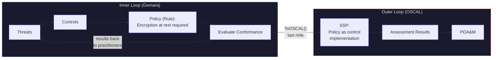

# Gemara: The GRC Architecture You Didn't Know You Built

Demo repository for [OpenSSF Community Day 2026](https://openssf.org/).

## Inner Loop, Outer Loop

Gemara and OSCAL serve different loops in the GRC lifecycle.

The **inner loop** is Gemara. Start from foundational guidance and regulations, model threats and capabilities for a specific technology, derive controls with assessment requirements, set organizational policy defining who must conform, evaluate conformance against sensitive activities, enforce corrective actions, and audit the efficacy of the whole chain. The full cycle focuses on practitioners, policy owners, and the organization iterating on their security posture.

The **outer loop** is OSCAL. For an organization subject to formal compliance requirements, OSCAL models the conversation with an external authority: author and tailor control catalogs into profiles, document how system components implement those controls in an SSP, plan and execute assessments, record assessment results, and track remediation through POA&M. The cycle crosses the organizational boundary -- the audience is the assessor, the regulator, the authorizing official.

The inner loop runs continuously. The outer loop runs when you need to prove it to someone outside.



Consider an organizational policy on encryption at rest. It appears in both loops, but serves a different purpose:

- **Inner loop (Gemara):** the policy is a **rule** -- it defines who is subject to the requirement and what they must do. Practitioners evaluate their deployment against it and feed results back.
- **Outer loop (OSCAL):** the policy is a **control implementation** -- it describes how the system satisfies the requirement. It sits inside an SSP as part of the system's compliance posture for an external assessor.

| | **Inner Loop (Gemara)** | **Outer Loop (OSCAL)** |
|:--|:--|:--|
| **Direction** | Inward, to practitioners | Outward, to assessors |
| **Purpose** | Enable conformance | Prove compliance |
| **Audience** | Maintainer, operator, SRE | Auditor, regulator, authorizing official |
| **Boundary** | People -- who is subject to the policy | Systems -- what infrastructure is in scope of the authorization |
| **Captures** | Threats, capabilities, controls, evaluation | SSP, profiles, assessment results, POA&M |
| **Question** | "Who needs to do what, and why?" | "Does this system meet the requirements?" |

## Where They Meet

Projects like [FINOS Common Cloud Controls](https://github.com/finos/common-cloud-controls) author shared, reusable controls in Gemara. Upstream projects import those controls and specialize them with project-specific threat context and assessment requirements. Operators use that guidance to secure their deployments.

The inner loop artifacts -- control catalogs, policies, evaluation logs -- act as implementation and evidence for the outer loop. A Gemara Policy is a control implementation in an SSP. A Gemara EvaluationLog is assessment evidence. The inner loop produces what the outer loop documents.

But the inner loop alone cannot satisfy formal compliance. Gemara's boundary is people -- who is subject to the policy. Formal compliance requires a system boundary -- what infrastructure is in scope of the authorization. Without that system-scoping, you cannot write an SSP for a specific deployment, assess a specific system's control implementation, or grant authorization. The inner loop artifacts are necessary but not sufficient. The outer loop adds the system context that formal compliance demands.

That is where OSCAL enters. Tooling converts Gemara control catalogs and evaluation logs into OSCAL Catalogs and Assessment Results, placing the inner loop's artifacts into the system-scoped structure that assessors and regulators require.

Neither replaces the other. Gemara has no SSP or POA&M. OSCAL has no threats or capabilities. They share a boundary at **control catalogs** and **assessment results**.

## What This Demo Shows

A Go CLI loads [Gemara governance artifacts](#governance-artifacts) for the [CloudNativePG](https://cloudnative-pg.io/) operator, validates cross-references between threat and control catalogs, and converts them to OSCAL using the [`go-gemara`](https://github.com/gemaraproj/go-gemara) SDK.

```
Gemara YAML ──▶ go-gemara SDK ──▶ OSCAL JSON + Markdown
(engineering)     (bridge)         (last mile)
```

A GitHub Actions workflow runs this on push to `main` and publishes the OSCAL artifacts as a GitHub Release.

### Input: Gemara Artifacts

| File | Type | Detail |
|:--|:--|:--|
| `governance/controls/controls.yaml` | ControlCatalog | 14 controls across 5 groups |
| `governance/catalogs/threat-catalog.yaml` | ThreatCatalog | Project-specific + imported threats |
| `governance/catalogs/capabilities.yaml` | CapabilityCatalog | Project-specific + imported capabilities |
| `governance/evaluation-log.yaml` | EvaluationLog | 5 control evaluations (3 Passed, 1 Failed, 1 Needs Review) |

### Output: OSCAL Artifacts

| File | OSCAL Type | Source |
|:--|:--|:--|
| `oscal-catalog.json` | Catalog | `ControlCatalog.ToOSCAL()` |
| `oscal-assessment-results.json` | Assessment Results | `EvaluationLog.ToOSCAL()` |
| `controls.md` | Markdown | `ControlCatalog.ToMarkdown()` |
| `summary.md` | Markdown | Assessment summary with pass/fail breakdown |

## Quick Start

```shell
make run
```

Builds the Go binary and runs the conversion. Output lands in `output/`.

```shell
make clean
```

Removes build and output directories.

## Governance Artifacts

The `governance/` directory contains Gemara artifacts for the CNCF CloudNativePG project. The original threat assessment was created during the [2026 Security Slam](https://github.com/cloudnative-pg/cloudnative-pg/pull/10304) and migrated to Gemara v1.0.0 using the [Gemara MCP Server](https://github.com/gemaraproj/gemara-mcp).

## Links

- [Gemara](https://gemara.openssf.org/)
- [OSCAL](https://pages.nist.gov/OSCAL/)
- [go-gemara SDK](https://github.com/gemaraproj/go-gemara)
- [CloudNativePG](https://cloudnative-pg.io/)
